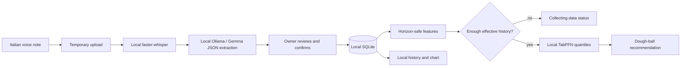

# Doughcast

Doughcast is a local-first assistant for one pizzeria. The owner records a
short Italian voice note after a shift; the app transcribes it locally,
extracts a structured daily record for human confirmation, stores it in
SQLite, and is designed to forecast demand two days ahead for dough
preparation. One pizza uses one 180 g dough ball, so a forecast can become an
operational preparation quantity without sending the shop's data to a cloud
service.

**Who it is for:** one real friend who runs a pizzeria.

**Friend and permission:** `[TODO: add the friend's name or a pseudonym only
with permission, and describe the permission granted.]`

## Current status

The local voice and deterministic extraction paths are implemented. The
text-only evaluator covers 25 cases and reports exact match `1.00` with a
hallucination rate of `0.00` in [reports/extraction_eval.json](reports/extraction_eval.json).
Those are parser/evaluator results, not Gemma or Whisper accuracy results.

The public forecasting benchmark is currently blocked before evaluation. On
the tested Python 3.14 environment, the Hugging Face loader raises
`TypeError: Pickler._batch_setitems() takes 2 positional arguments but 3 were
given`. Therefore this repository makes no TabPFN, LightGBM, or proxy accuracy
claim. The same issue blocks cold-start. Details are in
[reports/FINDINGS.md](reports/FINDINGS.md), [reports/benchmark.json](reports/benchmark.json),
and [reports/QA.md](reports/QA.md).

## Architecture



The live product is TabPFN-only after its readiness gate; seasonal, weekday,
and LightGBM models are evaluation comparators, not silent fallbacks. Recalled
history is marked `source="recalled"` and is excluded from fitting unless the
configuration explicitly enables it. Audio uploads are temporary and are
deleted by the API after processing.

## Setup

Prerequisites are Python 3.11+, `ffmpeg` for compressed audio, Ollama with a
Gemma model, and locally downloaded model weights for live voice use. The
current QA run used Python 3.14; tests passed, but the public dataset loader did
not. The exact Ollama tag and TabPFN checkpoint/license still need verification
in the target environment.

```sh
make setup
make test
make eval-extraction
make demo
```

Open `http://127.0.0.1:8000`. Set `WHISPER_MODEL` (default `small`) and
`OLLAMA_MODEL` (default `gemma4:e4b`) as environment variables. Keep real data,
audio, `.env` files, and tokens under ignored paths; never commit them.

`make benchmark` and `make cold-start` are the reproduction commands for the
forecasting reports, but currently produce blocked reports on the tested
environment. `make offline-check` is not yet a real network-blocked check, and
`make import-private` is a placeholder; neither should be read as a completed
workflow.

## Reproduce the reports

```sh
make eval-extraction  # reports/extraction_eval.json
make benchmark        # reports/benchmark.json
make cold-start       # reports/cold_start.json
make test
```

The intended forecast evaluation uses the public restaurant visitor dataset as
a proxy, not pizza sales, and rolling-origin validation. The checked-in
benchmark status is `blocked`, not a result. The extraction report is
deterministic text-only evaluation and does not call Whisper or Ollama.

## Licenses and verification status

Only statuses verified in this checkout are stated as facts. The entries below
identify dependencies whose terms must be checked against their current model,
weight, or dataset cards before publication.

| Component | Status in this checkout |
| --- | --- |
| Doughcast code | No project-specific license decision recorded yet. **TODO: human/orchestrator decision.** |
| Gemma | Used through local Ollama structured output. Model-card license: **UNVERIFIED**. |
| faster-whisper and Whisper weights | Used for local Italian transcription. Code and weight licenses: **UNVERIFIED**. |
| TabPFN | Local quantile API inspected in TabPFN `9.1.0`; active checkpoint terms, token requirement, and license: **UNVERIFIED**. Do not call it fully open source. |
| Hugging Face restaurant dataset | Used only as a public visitor proxy. Dataset-card license and attribution: **UNVERIFIED**. |

## Limits and known gaps

- The public data measures restaurant visitors, not pizzas, and there is no
	benchmark result yet because dataset loading is blocked on Python 3.14.
- `sold_out=true` is required to mean censored demand, but QA found that the
	current evaluation still treats the observed value as exact demand. This is
	an open forecasting correctness issue, not a solved feature.
- QA found that `make offline-check` is a no-op and that the upload boundary
	does not yet enforce content or duration limits.
- Live Whisper, Ollama/Gemma, ffmpeg, and the gated TabPFN checkpoint were not
	verified in the QA environment. No real friend data or audio is included.
- Recipe percentages, friend permissions, opening schedule, and any final
	model tags remain human-owned TODOs.

## What the friend said

`[TODO: human-only section. Add the friend's words, reaction, permission,
workflow details, and any photo/demo context. Do not invent a quote.]`

## Commits after the deadline

Challenge deadline: **2026-10-05 06:59 UTC**.

`[TODO: record every commit made after the deadline, or write “None” after the
deadline has passed and history has been checked.]`