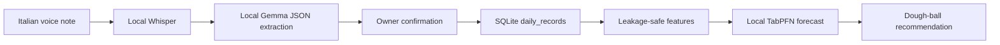

# Architecture

Doughcast is planned as a local-first pipeline:

`src/dough/voice/transcribe.py` loads faster-whisper lazily, forces Italian decoding, and supplies pizzeria vocabulary as an initial prompt. `src/dough/voice/extract.py` sends the transcript to a local Ollama client with a JSON schema, retries once, validates with `DailyRecord`, and returns Italian warnings. `mode="recalled"` uses an array schema and marks returned records as recalled. `src/dough/voice/evaluate.py` is deliberately model-free so `make eval-extraction` is deterministic and offline.

The API layer owns temporary upload cleanup; voice functions accept a path but do not persist audio. The real model path requires locally installed faster-whisper weights, Ollama/Gemma, and ffmpeg for compressed containers.

The data layer loads the Hugging Face restaurant series into tidy daily rows,
records inspection metadata in `reports/dataset_summary.md`, and prefers
Italian-like, long, low-gap series. `src/dough/data/features.py` builds
calendar features plus history features from dates no newer than
`target_date - HORIZON_DAYS`; incomplete warm-up rows are excluded from the
readiness count. Baselines and LightGBM are used only for evaluation. The live
forecast model remains TabPFN-only and must not silently fall back to a
baseline.

## Contracts

- `DailyRecord` uses nullable fields and validates weather and `HH:MM` sold-out times.
- `Forecast` contains p10/p50/p90 demand estimates and a dough recommendation.
- SQLite upserts records by ISO date and can filter or export them as CSV.
- `make benchmark` performs rolling-origin evaluation and writes
    `reports/benchmark.json`; `make cold-start` writes `reports/cold_start.json`.
- `reports/FINDINGS.md` records blocked external checks and negative results;
    visitor proxy numbers must never be described as pizza demand results.