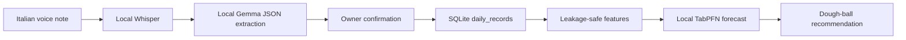

# Architecture

Doughcast is planned as a local-first pipeline:

The current scaffold establishes `DailyRecord` and `Forecast` in `src/dough/schemas.py` and persistence in `src/dough/store.py`. Heavy model integrations, routes, and UI are reserved for later agents.

## Contracts

- `DailyRecord` uses nullable fields and validates weather and `HH:MM` sold-out times.
- `Forecast` contains p10/p50/p90 demand estimates and a dough recommendation.
- SQLite upserts records by ISO date and can filter or export them as CSV.